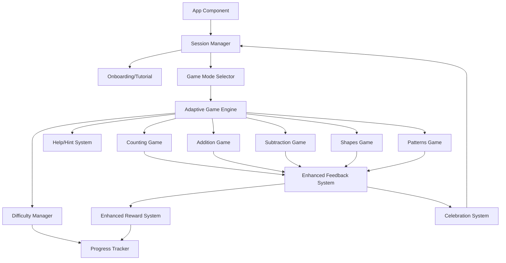

# Math Blaster for 4-5 Year Olds - Fresh Development Plan

## Core Philosophy

This game is designed specifically for **4-5 year old children** with these principles:

- **10-minute focused sessions** with natural break points
- **Adaptive difficulty** that adjusts to each child's ability
- **Frustration prevention** through hints and easier questions after mistakes
- **Immediate positive feedback** to maintain engagement
- **Balanced learning and fun** - learning happens through play

## Key Differences from Previous Plan

1. **Age-specific focus**: 4-5 year olds, not 3-5 (narrower developmental range)
2. **Adaptive difficulty system**: Questions get easier/harder based on performance
3. **Session management**: 10-minute sessions with celebration breaks
4. **Frustration prevention**: Help system, easier questions after mistakes
5. **Enhanced onboarding**: First-time player tutorial
6. **Better engagement**: More frequent rewards, varied activities, celebration moments

## Architecture Overview



## Implementation Plan

### Phase 1: Core Infrastructure & Session Management

**New Files:**

- [`math-game/src/utils/sessionManager.ts`](math-game/src/utils/sessionManager.ts) - Manages 10-minute sessions, break points, session history
- [`math-game/src/utils/difficultyManager.ts`](math-game/src/utils/difficultyManager.ts) - Adaptive difficulty system that adjusts based on performance
- [`math-game/src/components/SessionManager.tsx`](math-game/src/components/SessionManager.tsx) - Session UI component with timer and break prompts

**Key Features:**

- Track session start time and duration
- Show gentle "great job!" break prompts at 5 minutes
- End session celebration at 10 minutes (with option to continue)
- Save session data for progress tracking
- Prevent fatigue with natural stopping points

**Why this matters**: 4-5 year olds have limited attention spans. Structured 10-minute sessions with breaks prevent frustration and maintain engagement.

### Phase 2: Adaptive Difficulty System

**New Files:**

- [`math-game/src/utils/difficultyManager.ts`](math-game/src/utils/difficultyManager.ts) - Core difficulty logic
- [`math-game/src/types/difficulty.ts`](math-game/src/types/difficulty.ts) - Difficulty level types and interfaces

**Modify:**

- [`math-game/src/Questions/Questions.tsx`](math-game/src/Questions/Questions.tsx) - Add difficulty-aware question generation

**Difficulty Levels:**

- **Level 1 (Beginner)**: Counting 1-5, Addition sums 1-5, Subtraction within 5, Simple shapes, 2-item patterns
- **Level 2 (Easy)**: Counting 1-10, Addition sums 1-10, Subtraction within 10, Common shapes, 3-item patterns
- **Level 3 (Medium)**: Counting 1-15, Addition sums 1-15, Subtraction within 15, All shapes, 4-item patterns
- **Level 4 (Advanced)**: Counting 1-20, Addition sums 1-20, Subtraction within 20, Complex patterns

**Adaptive Logic:**

- Start at Level 2 (Easy) for new players
- After 3 correct answers in a row → increase difficulty
- After 2 incorrect answers in a row → decrease difficulty
- Track performance over last 5 questions
- Never go below Level 1 or above Level 4

**Why this matters**: Each child learns at their own pace. Adaptive difficulty ensures they're always challenged but never overwhelmed.

### Phase 3: Enhanced Feedback & Frustration Prevention

**New Files:**

- [`math-game/src/components/HelpSystem.tsx`](math-game/src/components/HelpSystem.tsx) - Help/hint button and system
- [`math-game/src/components/EnhancedFeedback.tsx`](math-game/src/components/EnhancedFeedback.tsx) - More encouraging feedback messages
- [`math-game/src/utils/feedbackMessages.ts`](math-game/src/utils/feedbackMessages.ts) - Varied, age-appropriate feedback

**Modify:**

- [`math-game/src/components/Game.tsx`](math-game/src/components/Game.tsx) - Integrate help system and enhanced feedback

**Features:**

- **Help Button**: Large, always-visible help button that provides hints
                                                                                                                                                                                                                                                                - Counting: "Let's count together! Tap each item once."
                                                                                                                                                                                                                                                                - Addition: "Count the first group, then the second group, then add them!"
                                                                                                                                                                                                                                                                - Subtraction: "Start with the big number, then take away the small number."
- **Encouraging Feedback**: Varied messages instead of just "Correct!"
                                                                                                                                                                                                                                                                - "Awesome! 🌟", "You're a math star! ⭐", "Perfect! 🎉", "Great counting! 🔢"
- **After Mistakes**: Automatically show easier question next
- **Visual Hints**: Subtle animations that guide attention

**Why this matters**: 4-5 year olds get frustrated easily. Help system and easier questions after mistakes prevent giving up.

### Phase 4: Onboarding & First-Time Experience

**New Files:**

- [`math-game/src/components/Onboarding.tsx`](math-game/src/components/Onboarding.tsx) - Interactive tutorial for first-time players
- [`math-game/src/utils/onboarding.ts`](math-game/src/utils/onboarding.ts) - Onboarding state management

**Features:**

- **Welcome Screen**: Friendly character introduces the game
- **Interactive Tutorial**: 
                                                                                                                                                                                                                                                                - Step 1: "Tap the colorful buttons to choose a game!"
                                                                                                                                                                                                                                                                - Step 2: "Count the animals by tapping them!"
                                                                                                                                                                                                                                                                - Step 3: "Choose your answer from the big buttons!"
                                                                                                                                                                                                                                                                - Step 4: "Great job! You're ready to play!"
- **Skip Option**: For returning players or if child wants to explore
- **Progress Indicator**: Show which step they're on

**Why this matters**: First-time players need guidance. Onboarding teaches them how to play without frustration.

### Phase 5: Enhanced Rewards & Celebrations

**Modify:**

- [`math-game/src/components/RewardSystem.tsx`](math-game/src/components/RewardSystem.tsx) - More frequent, varied rewards
- [`math-game/src/utils/rewards.ts`](math-game/src/utils/rewards.ts) - Enhanced reward logic

**New Files:**

- [`math-game/src/components/CelebrationSystem.tsx`](math-game/src/components/CelebrationSystem.tsx) - Celebration moments (every 5 questions, session end)

**Reward Frequency:**

- **Every correct answer**: Visual celebration (confetti, stars)
- **Every 3 correct**: Small reward (sticker)
- **Every 5 correct**: Medium reward (star + celebration screen)
- **Every 10 correct**: Big reward (trophy + big celebration)
- **Session end**: Summary celebration with achievements

**Reward Types:**

- Stickers (varied: animals, shapes, stars, hearts)
- Stars (collected in progress tracker)
- Trophies (special achievements)
- Celebration animations (confetti, bouncing emojis)

**Why this matters**: 4-5 year olds need frequent positive reinforcement. More rewards maintain motivation.

### Phase 6: Game Mode Enhancements

**Modify All Game Components:**

- [`math-game/src/components/CountingGame.tsx`](math-game/src/components/CountingGame.tsx) - Rename from VisualCounter, add difficulty levels
- [`math-game/src/components/AdditionGame.tsx`](math-game/src/components/AdditionGame.tsx) - Add difficulty levels, better visuals
- [`math-game/src/components/SubtractionGame.tsx`](math-game/src/components/SubtractionGame.tsx) - Add difficulty levels, visual aids
- [`math-game/src/components/ShapesGame.tsx`](math-game/src/components/ShapesGame.tsx) - Add difficulty levels, more shape types
- [`math-game/src/components/PatternsGame.tsx`](math-game/src/components/PatternsGame.tsx) - Add difficulty levels, pattern complexity

**Enhancements:**

- **Counting**: Add difficulty levels (1-5, 1-10, 1-15, 1-20)
- **Addition/Subtraction**: Visual grouping, number lines for harder problems
- **Shapes**: More shapes at higher levels, shape matching games
- **Patterns**: Longer patterns at higher levels, mixed patterns (color + shape)

**Why this matters**: Variety within each mode keeps children engaged. Difficulty levels provide clear progression.

### Phase 7: Progress Tracking & Analytics

**Modify:**

- [`math-game/src/utils/progress.ts`](math-game/src/utils/progress.ts) - Enhanced progress tracking with difficulty levels
- [`math-game/src/components/ProgressTracker.tsx`](math-game/src/components/ProgressTracker.tsx) - Show difficulty progression

**New Data Tracked:**

- Current difficulty level per game mode
- Questions answered correctly/incorrectly
- Average time per question
- Session history (date, duration, questions answered)
- Streak tracking (consecutive correct answers)

**Why this matters**: Track what the child is learning and where they need support. Helps identify when to adjust difficulty.

### Phase 8: UI/UX Polish for 4-5 Year Olds

**Modify:**

- [`math-game/src/styles/App.css`](math-game/src/styles/App.css) - Refine for 4-5 year old attention and motor skills
- [`math-game/src/styles/animations.css`](math-game/src/styles/animations.css) - Add more engaging animations

**Improvements:**

- **Larger touch targets**: Minimum 80px (not 60px) for easier tapping
- **Clearer visual hierarchy**: Important elements are bigger and brighter
- **Reduced cognitive load**: One thing at a time, clear instructions
- **Better color contrast**: Easier to distinguish elements
- **Smoother animations**: More polished, less jarring transitions

**Why this matters**: 4-5 year olds are still developing fine motor skills. Larger targets and clearer visuals reduce frustration.

## Technical Implementation Details

### Difficulty Manager Logic

```typescript
interface DifficultyState {
  level: 1 | 2 | 3 | 4;
  correctStreak: number;
  incorrectStreak: number;
  recentPerformance: boolean[]; // Last 5 questions
}

function adjustDifficulty(state: DifficultyState, isCorrect: boolean): DifficultyState {
  // Update streaks and performance
  // Increase difficulty after 3 correct in a row
  // Decrease difficulty after 2 incorrect in a row
  // Consider recent performance (last 5 questions)
}
```

### Session Manager Logic

```typescript
interface Session {
  startTime: Date;
  duration: number; // in seconds
  questionsAnswered: number;
  correctAnswers: number;
  gameMode: GameMode;
}

function checkSessionBreak(session: Session): boolean {
  // Return true if 5 minutes passed (suggest break)
  // Return true if 10 minutes passed (end session)
}
```

## Success Criteria

- Child can complete a 10-minute session without frustration
- Difficulty adapts appropriately to child's ability
- Help system prevents giving up after mistakes
- Rewards maintain engagement throughout session
- First-time players can start playing without confusion
- Progress clearly shows improvement over time
- All interactions are touch-friendly for 4-5 year olds

## File Structure (After Implementation)

```
math-game/
├── src/
│   ├── components/
│   │   ├── Onboarding.tsx (new)
│   │   ├── SessionManager.tsx (new)
│   │   ├── HelpSystem.tsx (new)
│   │   ├── EnhancedFeedback.tsx (new)
│   │   ├── CelebrationSystem.tsx (new)
│   │   ├── CountingGame.tsx (renamed from VisualCounter)
│   │   ├── AdditionGame.tsx (enhanced)
│   │   ├── SubtractionGame.tsx (enhanced)
│   │   ├── ShapesGame.tsx (enhanced)
│   │   ├── PatternsGame.tsx (enhanced)
│   │   ├── GameModeSelector.tsx (enhanced)
│   │   ├── RewardSystem.tsx (enhanced)
│   │   └── ProgressTracker.tsx (enhanced)
│   ├── utils/
│   │   ├── sessionManager.ts (new)
│   │   ├── difficultyManager.ts (new)
│   │   ├── feedbackMessages.ts (new)
│   │   ├── onboarding.ts (new)
│   │   ├── progress.ts (enhanced)
│   │   └── rewards.ts (enhanced)
│   ├── types/
│   │   └── difficulty.ts (new)
│   └── Questions/
│       └── Questions.tsx (enhanced with difficulty)
```

## Development Priorities

1. **Critical Path**: Session Management → Adaptive Difficulty → Help System
2. **High Impact**: Onboarding → Enhanced Rewards → Celebrations
3. **Polish**: UI/UX refinements → Progress tracking enhancements

This plan focuses specifically on 4-5 year olds with features that address their unique developmental needs: shorter attention spans, need for frequent positive feedback, frustration prevention, and adaptive learning.

---

## Architectural Design Notes

### Current Architecture Assessment

**Current State:**

- **Frontend**: React 18.2 with TypeScript, using Create React App
- **State Management**: Component-level state with localStorage for persistence
- **Data Storage**: Browser localStorage only (no backend)
- **Component Pattern**: Class components (Game.tsx) and functional components mixed
- **Styling**: CSS files with animations

**Architectural Decisions Needed:**

1. **State Management Strategy**

                                                                                                                                                                                                                                                                                                                                                                                                - **Current**: Local component state + localStorage
                                                                                                                                                                                                                                                                                                                                                                                                - **Recommendation**: Consider Context API or Zustand for:
                                                                                                                                                                                                                                                                                                                                                                                                                                                                                                                                                                                                                                                                - Session state (shared across components)
                                                                                                                                                                                                                                                                                                                                                                                                                                                                                                                                                                                                                                                                - Difficulty state (needs to persist across game modes)
                                                                                                                                                                                                                                                                                                                                                                                                                                                                                                                                                                                                                                                                - Progress state (accessed by multiple components)
                                                                                                                                                                                                                                                                                                                                                                                                - **Why**: As features grow, prop drilling becomes problematic. Centralized state makes session management and difficulty tracking easier.

2. **Component Architecture**

                                                                                                                                                                                                                                                                                                                                                                                                - **Current**: Mix of class and functional components
                                                                                                                                                                                                                                                                                                                                                                                                - **Recommendation**: Migrate to functional components with hooks for consistency
                                                                                                                                                                                                                                                                                                                                                                                                - **Why**: Hooks provide better composition, easier testing, and align with React best practices. The Game component should be refactored to use hooks.

3. **Data Persistence Layer**

                                                                                                                                                                                                                                                                                                                                                                                                - **Current**: Direct localStorage calls in utility functions
                                                                                                                                                                                                                                                                                                                                                                                                - **Recommendation**: Create a data access layer abstraction:
     ```typescript
     // utils/storage.ts - Abstraction layer
     export interface StorageAdapter {
       get<T>(key: string): T | null;
       set<T>(key: string, value: T): void;
       remove(key: string): void;
     }
     ```

                                                                                                                                                                                                                                                                                                                                                                                                - **Why**: Makes it easier to swap localStorage for IndexedDB (for larger data) or backend API later. Also enables better error handling and data validation.

4. **Type Safety**

                                                                                                                                                                                                                                                                                                                                                                                                - **Current**: Basic TypeScript types
                                                                                                                                                                                                                                                                                                                                                                                                - **Recommendation**: Create comprehensive type definitions:
                                                                                                                                                                                                                                                                                                                                                                                                                                                                                                                                                                                                                                                                - `types/game.ts` - Game modes, question types
                                                                                                                                                                                                                                                                                                                                                                                                                                                                                                                                                                                                                                                                - `types/difficulty.ts` - Difficulty levels and state
                                                                                                                                                                                                                                                                                                                                                                                                                                                                                                                                                                                                                                                                - `types/session.ts` - Session data structures
                                                                                                                                                                                                                                                                                                                                                                                                                                                                                                                                                                                                                                                                - `types/progress.ts` - Progress tracking types
                                                                                                                                                                                                                                                                                                                                                                                                - **Why**: Better IDE support, catch errors at compile time, self-documenting code.

### Frontend Architecture Expansion

#### State Management Architecture

**Recommended Approach: React Context + Custom Hooks**

```typescript
// Context structure
src/
  contexts/
    SessionContext.tsx      // Session state and management
    DifficultyContext.tsx    // Difficulty state per game mode
    ProgressContext.tsx      // Progress tracking state
    OnboardingContext.tsx   // Onboarding state
```

**Why Context over Redux/Zustand?**

- Simpler for this use case (no complex async operations)
- Built into React (no extra dependencies)
- Sufficient for session, difficulty, and progress state
- Easy to understand for learning developers

**Custom Hooks Pattern:**

```typescript
// hooks/useSession.ts
export function useSession() {
  const [session, setSession] = useState<Session | null>(null);
  // Session management logic
  return { session, startSession, endSession, checkBreakPoint };
}

// hooks/useDifficulty.ts
export function useDifficulty(mode: GameMode) {
  const [difficulty, setDifficulty] = useState<DifficultyState>(...);
  // Difficulty adjustment logic
  return { difficulty, adjustDifficulty, resetDifficulty };
}
```

**Benefits:**

- Reusable logic across components
- Easier to test (test hooks independently)
- Clear separation of concerns
- Self-documenting API

#### Component Hierarchy & Data Flow

```
App
├── SessionManager (wraps everything, manages session lifecycle)
│   ├── Onboarding (conditional - first time only)
│   └── GameModeSelector (when no active game)
│       └── Game (when mode selected)
│           ├── HelpSystem (always visible)
│           ├── [Game Component] (Counting/Addition/etc.)
│           ├── EnhancedFeedback (conditional - after answer)
│           ├── CelebrationSystem (conditional - milestones)
│           ├── RewardSystem (conditional - reward earned)
│           └── ProgressTracker (always visible)
```

**Data Flow Principles:**

1. **Unidirectional**: Data flows down, events flow up
2. **Single Source of Truth**: Session state in SessionContext, difficulty in DifficultyContext
3. **Lifted State**: Shared state (session, difficulty) lives in contexts
4. **Local State**: UI-only state (animations, temporary feedback) stays in components

#### Performance Optimization Strategy

**1. Code Splitting**

```typescript
// Lazy load game components
const CountingGame = lazy(() => import('./components/CountingGame'));
const AdditionGame = lazy(() => import('./components/AdditionGame'));
// Wrap in Suspense with loading fallback
```

**Why**: Reduces initial bundle size. Each game mode only loads when needed.

**2. Memoization**

```typescript
// Memoize expensive calculations
const question = useMemo(
  () => generateQuestion(mode, difficulty),
  [mode, difficulty]
);

// Memoize components that receive stable props
const MemoizedProgressTracker = memo(ProgressTracker);
```

**Why**: Prevents unnecessary re-renders, especially important for smooth animations.

**3. Animation Performance**

- Use CSS transforms (translate, scale) instead of position changes
- Use `will-change` CSS property for animated elements
- Consider `requestAnimationFrame` for complex animations
- Debounce rapid state updates (e.g., timer updates)

**4. Image/Asset Optimization**

- Use WebP format with fallbacks
- Lazy load images below the fold
- Preload critical assets (sounds, celebration animations)

#### Accessibility Architecture

**WCAG 2.1 Level AA Compliance:**

1. **Keyboard Navigation**: All interactive elements must be keyboard accessible
2. **Screen Reader Support**: Proper ARIA labels, live regions for feedback
3. **Color Contrast**: Minimum 4.5:1 for text, 3:1 for UI components
4. **Focus Management**: Clear focus indicators, logical tab order
5. **Touch Targets**: Minimum 80px × 80px (already planned)

**Implementation:**

```typescript
// Accessible button component
<button
  aria-label="Count the animals"
  aria-describedby="help-text"
  className="game-button"
  onKeyDown={(e) => {
    if (e.key === 'Enter' || e.key === ' ') {
      handleClick();
    }
  }}
>
  {/* Content */}
</button>

// Live region for feedback
<div role="alert" aria-live="polite" aria-atomic="true">
  {feedbackMessage}
</div>
```

### Backend Work Analysis

#### Current State: No Backend Required (MVP)

**Assessment**: The current plan is designed as a **client-side only application** using localStorage. This is appropriate for an MVP because:

1. **No Multi-User Requirements**: Single child per device
2. **No Real-Time Features**: No multiplayer or live updates needed
3. **Simple Data**: Progress, scores, and session data fit in localStorage
4. **Offline-First**: Works without internet (important for kids' devices)

#### When Backend Would Be Needed

**Future Considerations (Post-MVP):**

1. **Multi-Device Sync**

                                                                                                                                                                                                                                                                                                                                                                                                - **Use Case**: Child plays on tablet at home, continues on parent's phone
                                                                                                                                                                                                                                                                                                                                                                                                - **Backend Requirements**:
                                                                                                                                                                                                                                                                                                                                                                                                                                                                                                                                                                                                                                                                - User accounts (anonymous or parent-managed)
                                                                                                                                                                                                                                                                                                                                                                                                                                                                                                                                                                                                                                                                - Data synchronization API
                                                                                                                                                                                                                                                                                                                                                                                                                                                                                                                                                                                                                                                                - Conflict resolution (last-write-wins or merge strategy)
                                                                                                                                                                                                                                                                                                                                                                                                - **Technology**: REST API or GraphQL, database (PostgreSQL/MongoDB)

2. **Parent Dashboard/Analytics**

                                                                                                                                                                                                                                                                                                                                                                                                - **Use Case**: Parents want to see progress, time spent, areas needing help
                                                                                                                                                                                                                                                                                                                                                                                                - **Backend Requirements**:
                                                                                                                                                                                                                                                                                                                                                                                                                                                                                                                                                                                                                                                                - Analytics aggregation
                                                                                                                                                                                                                                                                                                                                                                                                                                                                                                                                                                                                                                                                - Reporting API
                                                                                                                                                                                                                                                                                                                                                                                                                                                                                                                                                                                                                                                                - Data visualization endpoints
                                                                                                                                                                                                                                                                                                                                                                                                - **Technology**: Analytics service (Mixpanel, Amplitude) or custom analytics API

3. **Content Management**

                                                                                                                                                                                                                                                                                                                                                                                                - **Use Case**: Update questions, add new game modes without app update
                                                                                                                                                                                                                                                                                                                                                                                                - **Backend Requirements**:
                                                                                                                                                                                                                                                                                                                                                                                                                                                                                                                                                                                                                                                                - Content API
                                                                                                                                                                                                                                                                                                                                                                                                                                                                                                                                                                                                                                                                - Admin dashboard
                                                                                                                                                                                                                                                                                                                                                                                                                                                                                                                                                                                                                                                                - Versioning system
                                                                                                                                                                                                                                                                                                                                                                                                - **Technology**: Headless CMS (Contentful, Strapi) or custom CMS

4. **Social Features (Future)**

                                                                                                                                                                                                                                                                                                                                                                                                - **Use Case**: Share achievements, compare with friends (with parent approval)
                                                                                                                                                                                                                                                                                                                                                                                                - **Backend Requirements**:
                                                                                                                                                                                                                                                                                                                                                                                                                                                                                                                                                                                                                                                                - User profiles
                                                                                                                                                                                                                                                                                                                                                                                                                                                                                                                                                                                                                                                                - Friend connections
                                                                                                                                                                                                                                                                                                                                                                                                                                                                                                                                                                                                                                                                - Privacy controls
                                                                                                                                                                                                                                                                                                                                                                                                - **Technology**: Full backend with authentication, social graph

#### Backend Architecture (If Implemented)

**Recommended Stack:**

```
Backend:
 - Node.js + Express (or Next.js API routes)
 - PostgreSQL (structured data) or MongoDB (flexible schema)
 - Redis (caching, session storage)
 - JWT for authentication (if multi-user)

API Design:
 - RESTful endpoints
 - Versioned API (/api/v1/...)
 - Rate limiting
 - CORS configuration
```

**API Endpoints (Example):**

```typescript
// Progress & Session Management
GET    /api/v1/progress              // Get user progress
POST   /api/v1/progress              // Update progress
GET    /api/v1/sessions              // Get session history
POST   /api/v1/sessions              // Create new session

// Analytics (Parent Dashboard)
GET    /api/v1/analytics/summary     // Daily/weekly summary
GET    /api/v1/analytics/difficulty  // Difficulty progression
GET    /api/v1/analytics/time-spent  // Time analytics

// Content (If dynamic)
GET    /api/v1/content/questions     // Get question sets
GET    /api/v1/content/rewards       // Get reward definitions
```

**Data Models (Example):**

```typescript
// Session Model
interface Session {
  id: string;
  userId: string;
  startTime: Date;
  endTime?: Date;
  duration: number; // seconds
  gameMode: GameMode;
  questionsAnswered: number;
  correctAnswers: number;
  difficultyLevels: Record<GameMode, number>;
  createdAt: Date;
}

// Progress Model
interface Progress {
  userId: string;
  gameMode: GameMode;
  currentDifficulty: number;
  totalScore: number;
  bestScore: number;
  questionsAnswered: number;
  correctAnswers: number;
  streak: number;
  lastPlayed: Date;
  updatedAt: Date;
}
```

**Security Considerations:**

1. **COPPA Compliance**: If collecting data from children under 13, must comply with COPPA
2. **Data Privacy**: Minimal data collection, clear privacy policy
3. **Authentication**: Parent-managed accounts, not child accounts
4. **Rate Limiting**: Prevent abuse, protect API
5. **Input Validation**: Sanitize all user inputs
6. **HTTPS Only**: Encrypt all data in transit

### Data Architecture

#### Current Data Structure (localStorage)

**Storage Keys:**

- `mathBlasterProgress` - Main progress data
- `mathBlasterSession` - Current session (if any)
- `mathBlasterOnboarding` - Onboarding completion status
- `mathBlasterDifficulty` - Difficulty levels per game mode

**Enhanced Data Structure (Post-Implementation):**

```typescript
// Enhanced Progress Interface
interface EnhancedProgress {
  // Per-game-mode progress
  gameModes: {
    counting: GameModeProgress;
    addition: GameModeProgress;
    subtraction: GameModeProgress;
    shapes: GameModeProgress;
    patterns: GameModeProgress;
  };
  
  // Overall stats
  totalScore: number;
  totalQuestions: number;
  totalCorrect: number;
  rewards: number;
  
  // Session tracking
  sessions: SessionSummary[]; // Last 10 sessions
  currentStreak: number;
  longestStreak: number;
  
  // Difficulty tracking
  difficultyHistory: DifficultySnapshot[]; // Track difficulty changes over time
  
  // Metadata
  lastPlayed: string;
  createdAt: string;
  version: string; // For migration purposes
}

interface GameModeProgress {
  currentDifficulty: 1 | 2 | 3 | 4;
  bestScore: number;
  questionsAnswered: number;
  correctAnswers: number;
  averageTime: number; // milliseconds
  lastPlayed: string;
}

interface SessionSummary {
  date: string;
  duration: number; // seconds
  gameMode: GameMode;
  questionsAnswered: number;
  correctAnswers: number;
  difficultyReached: number;
}
```

**Data Migration Strategy:**

- Version the data structure
- Provide migration functions when structure changes
- Handle missing fields gracefully (backward compatibility)

#### Storage Optimization

**localStorage Limitations:**

- ~5-10MB limit (varies by browser)
- Synchronous API (can block UI)
- String-only storage (must JSON.stringify)

**Optimization Strategies:**

1. **Compress Data**: Use compression for large arrays (session history)
2. **Limit History**: Only store last 10 sessions, not all
3. **Lazy Loading**: Load session history only when viewing progress
4. **IndexedDB Migration**: If data grows, migrate to IndexedDB for larger storage

### Testing Strategy

#### Frontend Testing

**1. Unit Tests**

- **Target**: Utility functions, hooks, pure functions
- **Tools**: Jest + React Testing Library
- **Examples**:
                                                                                                                                                                                                                                                                - `difficultyManager.ts` - Test difficulty adjustment logic
                                                                                                                                                                                                                                                                - `sessionManager.ts` - Test session timing and break points
                                                                                                                                                                                                                                                                - `progress.ts` - Test progress calculations
                                                                                                                                                                                                                                                                - Custom hooks - Test state management

**2. Component Tests**

- **Target**: React components
- **Tools**: Jest + React Testing Library
- **Examples**:
                                                                                                                                                                                                                                                                - Game components render correctly
                                                                                                                                                                                                                                                                - Help system shows appropriate hints
                                                                                                                                                                                                                                                                - Celebration system triggers at milestones
                                                                                                                                                                                                                                                                - Onboarding flow works step-by-step

**3. Integration Tests**

- **Target**: User flows
- **Tools**: Jest + React Testing Library (or Playwright)
- **Examples**:
                                                                                                                                                                                                                                                                - Complete onboarding → select game → play → see progress
                                                                                                                                                                                                                                                                - Session management: start → 5 min break → 10 min end
                                                                                                                                                                                                                                                                - Difficulty adjustment: answer correctly → difficulty increases

**4. E2E Tests (Optional)**

- **Target**: Full user journeys
- **Tools**: Playwright or Cypress
- **Examples**:
                                                                                                                                                                                                                                                                - First-time user completes onboarding and plays a game
                                                                                                                                                                                                                                                                - Returning user resumes session and sees progress

#### Testing Priorities

**Critical Path Tests:**

1. Session management (timing, break points)
2. Difficulty adjustment (correct logic)
3. Progress tracking (data persistence)
4. Help system (prevents frustration)

**High Value Tests:**

1. Onboarding flow (first-time experience)
2. Reward system (triggers correctly)
3. Celebration system (milestones)

### Error Handling & Resilience

#### Error Boundaries

```typescript
// components/ErrorBoundary.tsx
class ErrorBoundary extends React.Component {
  // Catches React component errors
  // Shows child-friendly error message
  // Logs error for debugging
}
```

**Why**: Prevents app crashes, shows friendly messages to children.

#### Graceful Degradation

1. **localStorage Failures**: 

                                                                                                                                                                                                                                                                                                                                                                                                - Handle quota exceeded errors
                                                                                                                                                                                                                                                                                                                                                                                                - Fall back to in-memory storage
                                                                                                                                                                                                                                                                                                                                                                                                - Show warning to user

2. **Audio Failures**:

                                                                                                                                                                                                                                                                                                                                                                                                - AudioManager already handles missing files
                                                                                                                                                                                                                                                                                                                                                                                                - Continue game without sound if needed

3. **Network Failures** (if backend added):

                                                                                                                                                                                                                                                                                                                                                                                                - Offline mode with local storage
                                                                                                                                                                                                                                                                                                                                                                                                - Sync when connection restored

### Performance Monitoring

#### Metrics to Track

1. **Load Time**: Initial page load, game mode load
2. **Interaction Latency**: Time from tap to visual feedback
3. **Animation Performance**: FPS during celebrations
4. **Memory Usage**: Watch for memory leaks in long sessions
5. **Bundle Size**: Monitor as features are added

#### Tools

- **React DevTools Profiler**: Identify slow components
- **Chrome DevTools Performance**: Analyze runtime performance
- **Lighthouse**: Overall performance score
- **Bundle Analyzer**: Identify large dependencies

### Security Considerations

#### Frontend Security

1. **XSS Prevention**: 

                                                                                                                                                                                                                                                                                                                                                                                                - Sanitize any user-generated content (if added)
                                                                                                                                                                                                                                                                                                                                                                                                - Use React's built-in XSS protection (auto-escaping)

2. **localStorage Security**:

                                                                                                                                                                                                                                                                                                                                                                                                - No sensitive data (no PII)
                                                                                                                                                                                                                                                                                                                                                                                                - Data is device-local only

3. **Dependency Security**:

                                                                                                                                                                                                                                                                                                                                                                                                - Regular `npm audit` checks
                                                                                                                                                                                                                                                                                                                                                                                                - Keep dependencies updated

#### Privacy Considerations

1. **COPPA Compliance**: If adding backend, ensure COPPA compliance
2. **Data Minimization**: Only collect necessary data
3. **Parental Controls**: If multi-user, parent manages child accounts
4. **Clear Privacy Policy**: Explain what data is stored and why

---

## Expanded Frontend Implementation Details

### Phase 1: Core Infrastructure - Detailed Breakdown

#### Session Manager Implementation

**File: `src/utils/sessionManager.ts`**

```typescript
export interface Session {
  id: string;
  startTime: Date;
  duration: number; // seconds
  questionsAnswered: number;
  correctAnswers: number;
  gameMode: GameMode;
  breakPromptShown: boolean;
  ended: boolean;
}

export interface SessionState {
  currentSession: Session | null;
  sessionHistory: Session[];
}

// Key functions:
// - startSession(gameMode): Creates new session
// - updateSession(questionCount, correctCount): Updates current session
// - checkBreakPoint(): Returns 'none' | 'mid' | 'end'
// - endSession(): Finalizes and saves session
// - getSessionHistory(): Returns last 10 sessions
```

**File: `src/components/SessionManager.tsx`**

**Responsibilities:**

- Display session timer (countdown from 10 minutes)
- Show break prompt at 5 minutes
- Show end-of-session celebration at 10 minutes
- Handle "continue playing" option
- Save session data to localStorage

**UI Components:**

- Timer display (large, visible)
- Break modal (non-intrusive, can dismiss)
- End session modal (celebration, summary stats)

#### Difficulty Manager Implementation

**File: `src/utils/difficultyManager.ts`**

```typescript
export type DifficultyLevel = 1 | 2 | 3 | 4;

export interface DifficultyState {
  level: DifficultyLevel;
  correctStreak: number;
  incorrectStreak: number;
  recentPerformance: boolean[]; // Last 5 questions
  lastAdjustment: Date;
}

export interface DifficultyConfig {
  mode: GameMode;
  level: DifficultyLevel;
  // Mode-specific config
  counting?: { maxCount: number };
  addition?: { maxSum: number };
  subtraction?: { maxMinuend: number };
  // etc.
}

// Key functions:
// - getDifficulty(mode): Returns current difficulty for mode
// - adjustDifficulty(mode, isCorrect): Adjusts based on answer
// - getQuestionConfig(mode): Returns question parameters for current difficulty
// - resetDifficulty(mode): Resets to default (Level 2)
```

**Adaptive Algorithm Details:**

```typescript
function adjustDifficulty(
  state: DifficultyState, 
  isCorrect: boolean
): DifficultyState {
  // Update streaks
  if (isCorrect) {
    state.correctStreak++;
    state.incorrectStreak = 0;
  } else {
    state.incorrectStreak++;
    state.correctStreak = 0;
  }
  
  // Update recent performance (sliding window)
  state.recentPerformance.push(isCorrect);
  if (state.recentPerformance.length > 5) {
    state.recentPerformance.shift();
  }
  
  // Increase difficulty: 3 correct in a row OR 4/5 recent correct
  if (state.correctStreak >= 3 || 
      state.recentPerformance.filter(Boolean).length >= 4) {
    if (state.level < 4) {
      state.level++;
      state.correctStreak = 0; // Reset after adjustment
    }
  }
  
  // Decrease difficulty: 2 incorrect in a row OR 2/5 recent correct
  if (state.incorrectStreak >= 2 || 
      state.recentPerformance.filter(Boolean).length <= 2) {
    if (state.level > 1) {
      state.level--;
      state.incorrectStreak = 0; // Reset after adjustment
    }
  }
  
  return state;
}
```

### Phase 3: Help System - Detailed Implementation

**File: `src/components/HelpSystem.tsx`**

**Features:**

- Large, always-visible help button (bottom-right corner)
- Context-aware hints based on game mode and current question
- Visual highlighting (subtle pulse animation on relevant elements)
- Audio hints (optional, can be toggled)

**Hint Content by Game Mode:**

```typescript
const hints = {
  counting: [
    "Let's count together! Tap each item once.",
    "Count slowly: one, two, three...",
    "Look at all the items. How many do you see?"
  ],
  addition: [
    "Count the first group, then the second group, then add them!",
    "How many in the first group? How many in the second?",
    "Let's add them together!"
  ],
  subtraction: [
    "Start with the big number, then take away the small number.",
    "How many are left after we take some away?",
    "Count what's left!"
  ],
  shapes: [
    "Look at the shape. What do you see?",
    "Count the sides. How many corners?",
    "What shape looks like this?"
  ],
  patterns: [
    "What comes next in the pattern?",
    "Look at the colors and shapes. What pattern do you see?",
    "What would come after this?"
  ]
};
```

**Implementation Notes:**

- Rotate through hints (don't show same hint twice in a row)
- Show hint as modal overlay (non-blocking, can dismiss)
- Highlight relevant on-screen elements when hint is shown
- Track hint usage (for analytics, don't penalize for using hints)

### Phase 4: Onboarding - Detailed Flow

**File: `src/components/Onboarding.tsx`**

**Step-by-Step Flow:**

1. **Welcome Screen**

                                                                                                                                                                                                                                                                                                                                                                                                - Friendly character/mascot introduction
                                                                                                                                                                                                                                                                                                                                                                                                - "Welcome to Math Blaster!"
                                                                                                                                                                                                                                                                                                                                                                                                - Large "Let's Start!" button

2. **Step 1: Game Selection**

                                                                                                                                                                                                                                                                                                                                                                                                - Highlight game mode buttons
                                                                                                                                                                                                                                                                                                                                                                                                - "Tap a colorful button to choose a game!"
                                                                                                                                                                                                                                                                                                                                                                                                - Wait for user to tap (but don't actually start game)

3. **Step 2: Counting Tutorial**

                                                                                                                                                                                                                                                                                                                                                                                                - Show simplified counting game
                                                                                                                                                                                                                                                                                                                                                                                                - "Count the animals by tapping them!"
                                                                                                                                                                                                                                                                                                                                                                                                - Guide through one counting example
                                                                                                                                                                                                                                                                                                                                                                                                - Show correct answer selection

4. **Step 3: Answer Selection**

                                                                                                                                                                                                                                                                                                                                                                                                - "Choose your answer from the big buttons!"
                                                                                                                                                                                                                                                                                                                                                                                                - Highlight answer buttons
                                                                                                                                                                                                                                                                                                                                                                                                - Show feedback when correct answer selected

5. **Completion**

                                                                                                                                                                                                                                                                                                                                                                                                - "Great job! You're ready to play!"
                                                                                                                                                                                                                                                                                                                                                                                                - Celebration animation
                                                                                                                                                                                                                                                                                                                                                                                                - "Start Playing" button

**Implementation:**

- Use state machine for step management
- Store completion in localStorage
- Skip option available at any step
- Progress indicator (dots showing current step)

### Phase 5: Celebration System - Detailed Design

**File: `src/components/CelebrationSystem.tsx`**

**Celebration Triggers:**

- Every correct answer: Small confetti burst
- Every 3 correct: Sticker reward + animation
- Every 5 correct: Star reward + larger celebration
- Every 10 correct: Trophy + big celebration screen
- Session end: Summary celebration with achievements

**Celebration Types:**

1. **Confetti Burst** (every answer)

                                                                                                                                                                                                                                                                                                                                                                                                - Small particles, quick animation (1-2 seconds)
                                                                                                                                                                                                                                                                                                                                                                                                - Doesn't block gameplay

2. **Sticker Reward** (every 3)

                                                                                                                                                                                                                                                                                                                                                                                                - Sticker appears with bounce animation
                                                                                                                                                                                                                                                                                                                                                                                                - Collectible sticker shown
                                                                                                                                                                                                                                                                                                                                                                                                - "Great job!" message

3. **Star Celebration** (every 5)

                                                                                                                                                                                                                                                                                                                                                                                                - Star appears with sparkle effect
                                                                                                                                                                                                                                                                                                                                                                                                - "You're a star!" message
                                                                                                                                                                                                                                                                                                                                                                                                - Star added to progress tracker

4. **Trophy Celebration** (every 10)

                                                                                                                                                                                                                                                                                                                                                                                                - Full-screen celebration modal
                                                                                                                                                                                                                                                                                                                                                                                                - Trophy animation
                                                                                                                                                                                                                                                                                                                                                                                                - "Amazing work!" message
                                                                                                                                                                                                                                                                                                                                                                                                - Can dismiss after 3 seconds

5. **Session End Celebration**

                                                                                                                                                                                                                                                                                                                                                                                                - Summary screen showing:
                                                                                                                                                                                                                                                                                                                                                                                                                                                                                                                                                                                                                                                                - Total questions answered
                                                                                                                                                                                                                                                                                                                                                                                                                                                                                                                                                                                                                                                                - Correct answers
                                                                                                                                                                                                                                                                                                                                                                                                                                                                                                                                                                                                                                                                - Stars earned
                                                                                                                                                                                                                                                                                                                                                                                                                                                                                                                                                                                                                                                                - Time played
                                                                                                                                                                                                                                                                                                                                                                                                - "You did great today!" message
                                                                                                                                                                                                                                                                                                                                                                                                - Option to play again or take a break

**Animation Library:**

- Consider `framer-motion` for smooth animations
- Or CSS animations with `@keyframes` (lighter weight)
- Ensure animations are performant (60fps)

---

## Development Workflow & Best Practices

### Code Organization Principles

1. **Feature-Based Structure** (Alternative to current file-type structure):
   ```
   src/
     features/
       session/
         SessionManager.tsx
         sessionManager.ts
         useSession.ts
       difficulty/
         DifficultyManager.tsx
         difficultyManager.ts
         useDifficulty.ts
   ```


                                                                                                                                                                                                                                                                                                                                                                                                - **Pros**: Related code grouped together
                                                                                                                                                                                                                                                                                                                                                                                                - **Cons**: More restructuring needed

2. **Current Structure** (Keep but enhance):

                                                                                                                                                                                                                                                                                                                                                                                                - Keep `components/`, `utils/`, `types/` separation
                                                                                                                                                                                                                                                                                                                                                                                                - Add `hooks/` directory for custom hooks
                                                                                                                                                                                                                                                                                                                                                                                                - Add `contexts/` directory for React contexts

### Git Workflow

1. **Branch Strategy**: Feature branches (`feature/session-management`, `feature/difficulty-system`)
2. **Commit Messages**: Clear, descriptive ("Add session manager with 10-minute timer")
3. **Code Reviews**: Review before merging (if working in team)

### Documentation

1. **Code Comments**: Explain "why", not "what"
2. **README Updates**: Keep README current with new features
3. **Component Documentation**: JSDoc comments for complex components

---

## Migration & Refactoring Notes

### Refactoring Game Component

**Current**: Class component with complex state

**Target**: Functional component with hooks

**Steps:**

1. Convert class to function
2. Replace `this.state` with `useState` hooks
3. Replace lifecycle methods with `useEffect`
4. Extract logic to custom hooks (`useGame`, `useQuestion`)
5. Split into smaller components if needed

**Benefits:**

- Easier to test
- Better performance (hooks optimization)
- More maintainable
- Consistent with rest of codebase

### Data Migration

When enhancing progress structure:

1. Add version field to stored data
2. Create migration function
3. Run migration on app load if version mismatch
4. Handle missing fields gracefully

---

## Success Metrics & Validation

### User Experience Metrics

1. **Engagement**:

                                                                                                                                                                                                                                                                                                                                                                                                - Average session duration (target: 8-10 minutes)
                                                                                                                                                                                                                                                                                                                                                                                                - Questions per session (target: 15-25)
                                                                                                                                                                                                                                                                                                                                                                                                - Return rate (target: daily usage)

2. **Learning Effectiveness**:

                                                                                                                                                                                                                                                                                                                                                                                                - Difficulty progression (are children advancing?)
                                                                                                                                                                                                                                                                                                                                                                                                - Accuracy rate (target: 70-80% correct)
                                                                                                                                                                                                                                                                                                                                                                                                - Help system usage (are hints helpful?)

3. **Frustration Prevention**:

                                                                                                                                                                                                                                                                                                                                                                                                - Abandonment rate (sessions ended early)
                                                                                                                                                                                                                                                                                                                                                                                                - Help button clicks (indicates confusion)
                                                                                                                                                                                                                                                                                                                                                                                                - Difficulty decreases (indicates too hard)

### Technical Metrics

1. **Performance**:

                                                                                                                                                                                                                                                                                                                                                                                                - Page load time < 2 seconds
                                                                                                                                                                                                                                                                                                                                                                                                - Interaction latency < 100ms
                                                                                                                                                                                                                                                                                                                                                                                                - Animation FPS > 55fps

2. **Reliability**:

                                                                                                                                                                                                                                                                                                                                                                                                - No crashes (error boundary catches all)
                                                                                                                                                                                                                                                                                                                                                                                                - Data persistence success rate > 99%
                                                                                                                                                                                                                                                                                                                                                                                                - localStorage quota management

---

## Conclusion

This expanded plan provides:

1. **Architectural Foundation**: Clear decisions on state management, component structure, data flow
2. **Frontend Expansion**: Detailed implementation notes for each phase
3. **Backend Analysis**: When and why backend would be needed (not required for MVP)
4. **Testing Strategy**: Comprehensive testing approach
5. **Performance Considerations**: Optimization strategies
6. **Security & Privacy**: Important considerations for children's app

**Next Steps:**

1. Review and approve architectural decisions
2. Start with Phase 1 (Session Management) as foundation
3. Iterate on each phase, testing as you go
4. Refactor existing code to align with new architecture as needed